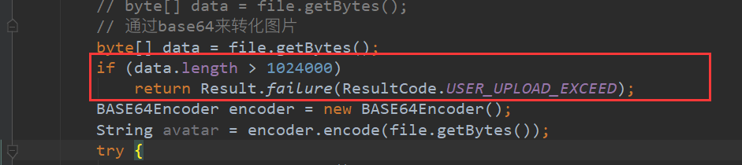

# 开发规范

1.仓库根目录 保证是源码

2.一定要保证代码整洁。包括注释的格式

3.这个日志打到logs 有点儿不太行 

4.设置个空行

5.代码按照职能按空行分块，适当加注释。

6.函数体之间加空行分割

7.注释格式

8.花括号不能省

9.写完代码随手格式化，参数太多了。超过4个参数 传对象或者传map

10.减少不必要的空行 

11.注意格式，sql要层次分明，逗号后面一律保留空格

12.短sql能一行写开就一行

13. 还是代码空行问题 

14.不需要的引入干掉，个人信息在引入下面

15.还有哈，controller只负责参数的拿取校验。具体逻辑操作放在service 。在service层适当打印info warn级别的日志。而不是下面这样光秃秃的调用dao

16.比如注册，除了取验参数之外的逻辑都下沉到service 

17.避免模糊的命名比如 id  统一用uid 或者 其他的比如book_id | bid | bookId,数据表小写 下划线 统一自增id 时间用timesamp 字段名最好也是下划线

18.过时的就不要用了

19.commit信息格式 [xxx] xxxxxxx

